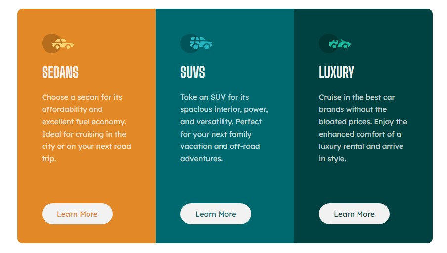

# Frontend Mentor - 3-column preview card component solution

This is a solution to the [3-column preview card component challenge on Frontend Mentor](https://www.frontendmentor.io/challenges/3column-preview-card-component-pH92eAR2-). Frontend Mentor challenges help you improve your coding skills by building realistic projects.

## Table of contents

- [Frontend Mentor - 3-column preview card component solution](#frontend-mentor---3-column-preview-card-component-solution)
  - [Table of contents](#table-of-contents)
  - [Overview](#overview)
    - [The challenge](#the-challenge)
    - [Screenshot](#screenshot)
    - [Links](#links)
  - [My process](#my-process)
    - [Built with](#built-with)
    - [What I learned](#what-i-learned)
    - [Continued development](#continued-development)
  - [Author](#author)

## Overview

### The challenge

Users should be able to:

- View the optimal layout depending on their device's screen size
- See hover states for interactive elements

### Screenshot

### Links

- Solution URL: [Github](https://github.com/suftdev/3-Column-Card-Component)
- Live Site URL: [Netlify](https://dainty-sorbet-3684b1.netlify.app/)

## My process

### Built with

- Semantic HTML5 markup
- CSS custom properties
- Flexbox

### What I learned

I learned about how to center containers and the importance of using flexbox in your workflow. Though it took me longer than anticipated, I was able to find an exact codepen solution that I followed through to finish the exercise. I hope my next challenges would get me applying these concepts I've work through.

### Continued development

-Flexbox
-CSS Grid
-Box Model
-Layout in general

## Author

- Frontend Mentor - [@suftdev](https://www.frontendmentor.io/profile/suftdev)
- Twitter - [@gsuftz](https://www.twitter.com/gsuftz)
